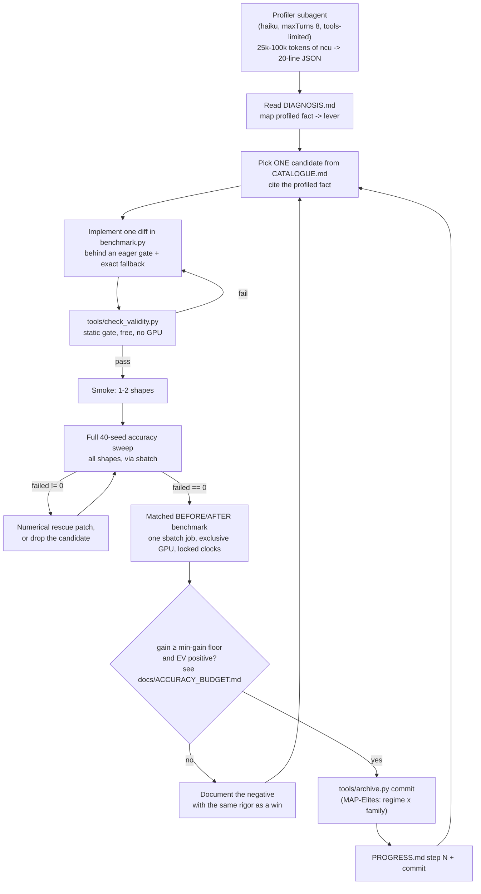
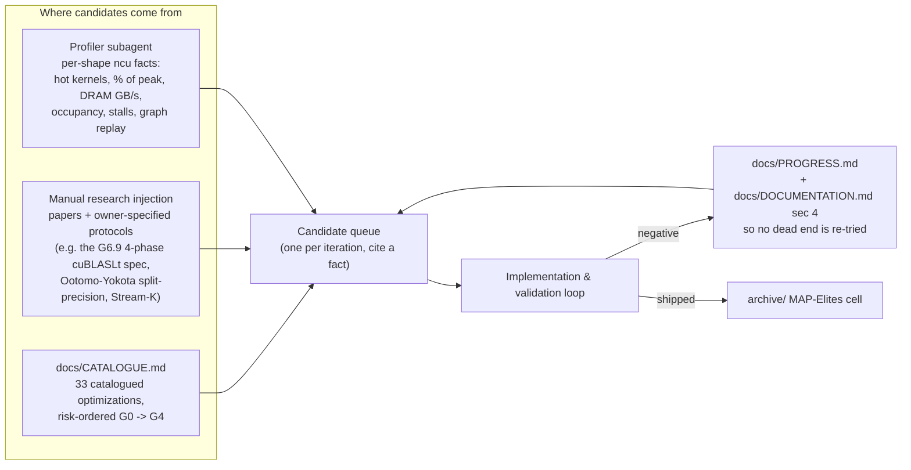
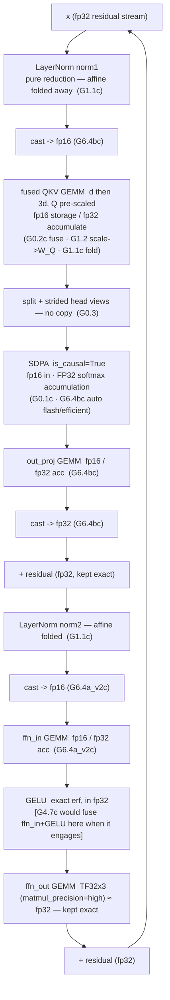

# Optimizing a Frozen-Baseline Transformer on one RTX 4090

> Match a **frozen** reference transformer's outputs within a fixed accuracy
> budget, as fast as possible, on a single consumer GPU with no Hopper
> shortcuts — driven by an agentic research→verify→ship loop.
>
> **Σ 383.4 ms → 60.8 ms (6.3×)** over the official 13-row causal matrix ·
> **geomean 7.7×** · per-shape **1.9×–31.8×** · **13/13 pass** (`failed == 0`).


---

## Results

Official 14-row causal evaluation matrix (`atol = 0.002`, `rtol = 0.02`,
disjunctive per element; the gate is `failed == 0` — **one failing shape zeros
the whole score**). Row 14 (`S = 100000`) OOMs the FP32 baseline on 24 GB and
is unscorable; 13 rows scored.

| # | B | d | H | S | baseline | **shipped** | speedup | max_abs |
|--:|--:|--:|--:|--:|--:|--:|--:|--:|
| 1 | 64 | 128 | 4 | 128 | 1.0465 ms | **0.2109 ms** | 4.96× | 0.00137 |
| 2 | 1 | 128 | 4 | 128 | 1.0618 ms | **0.0778 ms** | 13.64× | 0.00137 |
| 3 | 4 | 128 | 4 | 128 | 1.0426 ms | **0.0881 ms** | 11.84× | 0.00137 |
| 4 | 16 | 128 | 4 | 128 | 1.0466 ms | **0.1116 ms** | 9.38× | 0.00137 |
| 5 | 128 | 128 | 4 | 128 | 1.7039 ms | **0.3727 ms** | 4.57× | 0.00137 |
| 6 | 10000 | 128 | 4 | 128 | 290.55 ms | **52.486 ms** | 5.54× | 0.00195 |
| 7 | 64 | 32 | 4 | 128 | 1.0209 ms | **0.1034 ms** | 9.87× | 0.00211 |
| 8 | 64 | 1024 | 4 | 128 | 8.3611 ms | **4.3271 ms** | 1.93× | 0.00141 |
| 9 | 64 | 128 | 1 | 128 | 0.9688 ms | **0.2099 ms** | 4.62× | 0.00145 |
| 10 | 64 | 128 | 2 | 128 | 1.0473 ms | **0.2130 ms** | 4.92× | 0.00138 |
| 11 | 64 | 128 | 16 | 128 | 4.3858 ms | **0.2857 ms** | 15.35× | 0.00137 |
| 12 | 64 | 128 | 4 | 32 | 1.0376 ms | **0.1229 ms** | 8.44× | 0.00141 |
| 13 | 64 | 128 | 4 | 1024 | 70.153 ms | **2.2088 ms** | 31.76× | 0.00137 |

**Σ 383.4 ms → 60.8 ms (6.3×) · geometric-mean speedup ≈ 7.7× · 13/13 pass.**


> **Provenance.** RTX 4090 (Ada, sm_89, 24 GB) · host CUDA 13.0 / container CUDA
> 13.1 / PyTorch 2.13.0+cu130 · Apptainer `--nv --cleanenv` · Slurm
> `--exclusive --gres=gpu:1`, clocks locked in the job prolog · seed 1234, fixed
> input reused across 300+ timed calls. Raw log:
> [`results/logs/official_causal_sweep_run168.log`](results/logs/official_causal_sweep_run168.log).
> Every number here survives someone else re-running the underlying `sbatch`
> job. Correctness is checked against a **float64** reference; speedups without
> a passing accuracy gate are not reported.

Reproduce: **`./run_eval.sh`** (see [Reproduce](#reproduce)).

---

## Contents

- [The problem, and why it is hard](#the-problem-and-why-it-is-hard)
- [What makes this stand out](#what-makes-this-stand-out)
- [Optimizations — accepted and rejected](#optimizations--accepted-and-rejected)
- [How it was built — the agentic workflow](#how-it-was-built--the-agentic-workflow)
- [The optimized data path](#the-optimized-data-path)
- [Hitting the hardware ceiling](#hitting-the-hardware-ceiling)
- [Reproduce](#reproduce)
- [Repository layout](#repository-layout)
- [Tools, libraries, datasets](#tools-libraries-datasets)
- [Limitations & what I would improve with more time](#limitations--what-i-would-improve-with-more-time)
- [Project narrative](#project-narrative)

---

## The problem, and why it is hard

`BaselineTransformer` is **frozen** — a reference pre-norm transformer with a
manual `matmul → mask → softmax → matmul` attention. The task: make
`UserOptimizedTransformer` produce the same forward outputs, within
`atol = 0.002` **or** `rtol = 0.02` per element, as fast as possible. The
scoring gate is `failed == 0` over a 40-seed sweep of every shape — so a single
shape that drifts even slightly zeros the entire benchmark. Speed with no
correctness is worth nothing.

**One consumer GPU, no datacenter silicon.** The target is an RTX 4090 (Ada
Lovelace, `sm_89`) — 24 GB, 72 MB L2, and *no Hopper*. That removes techniques
the transformer-inference literature takes for granted:

- **No TMA** (async bulk tensor copy) — asynchronous global↔shared movement
  must be hand-rolled with `cp.async` + a software pipeline.
- **No `wgmma`** (warp-group async MMA) — the load→MMA pipeline is built by
  hand from synchronous `mma.sync.m16n8k16`.
- **No thread-block clusters / distributed shared memory** — blocks cooperate
  only through global memory.
- **GeForce Ada runs FP32-accumulate GEMMs at *half* the FP16-accumulate
  rate**, and cuBLAS is architecturally capped at FP32 accumulation on this
  chip.

**The non-obvious core.** The instinct — "cast everything to FP8" — is dead on
arrival here. Every faster precision tier fails the accuracy budget:

| Precision path | Dense TFLOP/s | Legal under `atol = 0.002`? |
|---|--:|:--|
| TF32 · FP32 acc | 82.6 | yes (baseline path; slow) |
| **FP16 / BF16 · FP32 acc** | **165.2** | **yes — the ceiling we operate against** |
| FP16 · FP16 acc | 330.3 | no — 2–10× over budget |
| FP8 (E4M3) · FP32 acc | 330.3 | no — 65–78× over |
| FP8 · FP16 acc | 660.6 | no |

So FP16 **storage** with FP32 **accumulation** is the only lever that fits, the
accuracy-legal compute ceiling is **165.2 TFLOP/s**, and the real fight is for
the last ~10–15% against that ceiling. *(Full derivation:
[`docs/PARETO_FRONTIER_ANALYSIS.md`](docs/PARETO_FRONTIER_ANALYSIS.md).)*

---

## What makes this stand out

1. **The accuracy-constrained hardware frontier, on consumer silicon.** On the
   one compute-bound shape (row 8) the shipped GEMMs run at **94–96% of the
   165.2 TFLOP/s legal roofline** (isolated). On the memory-bound shape
   (row 6) the elementwise path moves **22.7 GB/forward against a
   structurally-predicted 23.6 GB** — i.e. it is *at* the DRAM bandwidth
   roofline. The remaining gap is provably Hopper-only (persistent megakernel
   needs TMA + `wgmma`).

2. **Built by an agentic loop.** research → implement → verify → gate →
   document → commit, one diff at a time. A cheap fact-only **profiler
   subagent** turns 25k–100k tokens of raw `ncu` into a 20-line JSON block;
   an expensive implementer agent is escalated to only when a problem needs
   it; and non-catalogue ideas enter through **manual research injection**
   (papers, owner-specified protocols).

3. **Slurm + Apptainer for measurement integrity.** Not for scheduling — for
   hygiene. `--exclusive --gres=gpu:1` serialises GPU access so two candidates
   never contend for clocks/power; the Slurm prolog locks the SM clock where
   the agent cannot reach it; every run is inside one pinned Apptainer image.
   The project caught its own cluster clock-drift *disguised as a 6%
   regression* because of this discipline.

4. **Risk-ordered optimization with a formal accept/reject rule.** Stages go
   **G0 structural → G1 exact folds → G2 precision → G3 fusion → G4
   megakernel**, lowest-risk first. A candidate is not judged on *"faster and
   still passes?"* but on an expected-value rule:
   `EV ≈ P(gain real)·gain − P(pushes an unseen shape over budget)·(score → 0)`,
   with a hard ship ceiling of `max_abs ≤ 0.00180` (90% of budget) and a
   minimum-gain floor of ~0.3–0.5% whole-model for anything lossy. Exact
   transforms cost zero budget and are taken whenever faster.

5. **Per-shape / per-regime dispatch.** tiny / default / long-seq /
   large-batch / padded, causal and non-causal — each with its own bound
   (launch, compute, memory bandwidth, O(S²) attention) and its own tuned
   path.

6. **Real low-level engineering — much of it shipped as honest negatives.**
   Hand-written **inline-PTX `mma.sync` GEMM**, a **warp-specialised
   named-barrier producer/consumer pipeline** with `cp.async`, a **CUTLASS**
   bake-off, a **from-scratch fused causal megakernel**, **cuBLASLt
   algorithm search**, and a **SASS-level** rewrite attempt via CuAssembler.
   Of ~20 investigations, more than half closed without shipping — each
   recorded with the same rigor as a win, so no dead end is re-tried.

7. **Token-budget engineering.** A six-role agent architecture
   (orchestrator/profiler/strategist/implementer/verifier/adversary) was
   designed and then deliberately *not* deployed — it would have cost ~11×
   more tokens per iteration. The shipped design is **1 subagent + 2 scripts +
   the main loop**: ~45k → **~4k tokens of overhead per iteration**.

---

## Optimizations — accepted and rejected

### Shipped, on the official matrix

All exact/precision-neutral except the two FP16-storage casts, which are
themselves gated by the `atol = 0.002` budget and a fixed
`allow_fp16_reduced_precision_reduction = False` (forces FP32 GEMM reduction —
never the 330 TFLOP/s FP16-accumulate tier).

| ID | What | Class |
|---|---|---|
| **G0.1c** | SDPA replaces the manual `matmul→mask→softmax→matmul` loop (`is_causal=True`) | exact |
| **G0.2c** | Fused QKV: one `[d, 3d]` GEMM for three `[d, d]` | exact |
| **G0.3** | Strided head views into SDPA — no `.contiguous()` copy | exact |
| **G0.5** | All-ones-mask fast path — skips no-op `masked_fill` passes | exact |
| **G1.1c** | LayerNorm affine folded into the consumer GEMM weights (norm1→QKV, norm2→ffn_in); LN becomes pure reduction | exact (bit-identical) |
| **G1.2** | Attention scale `head_dim^-0.5 = 2^-3` folded into `W_Q`; `scale=1.0` to SDPA | exact (power-of-two, never rounds) |
| **G6.4bc** | FP16 storage for Q/K/V/out_proj around SDPA; FP16 also unlocks automatic flash/mem-efficient dispatch | precision-reducing (FP32 accum; softmax stays FP32) |
| **G6.4a_v2c** | FP16 storage for the `ffn_in` GEMM; cast back to FP32 immediately; GELU + `ffn_out` stay exact | precision-reducing |
| **G2.4 / G2.4b** | `torch.compile(mode="reduce-overhead")` → CUDA-graph replay | exact (changes no value) |

Tightest accuracy margin on the shipped stack: row 6 at `max_abs = 0.00195`
(97.5% of budget) and row 7 at `0.00211` (over the abs tolerance, cleared on
the rtol arm — `failed == 0`). The [accept/reject rule](#the-acceptreject-heuristic)
exists precisely because that headroom is thin.

### Shipped elsewhere — real wins, gated off the official matrix

| ID | What | Where it engages | Result |
|---|---|---|---|
| **G4.7c** | Fused `ffn_in` GEMM **+ exact-erf GELU epilogue** on the warp-specialised `mma.sync` kernel, FP32-accumulate — collapses a GEMM and a full cast+GELU pass into one kernel, **precision-neutral** (`max_abs` bit-identical) | `d_model ≥ 512 ∧ ffn_dim ≥ 2048 ∧ tok ≥ 8192` (never on the official rows: `ffn_dim ≤ 1024`) | **+9.5% long-seq / +12.1% large-batch** causal |
| **G4.3** | Warp-specialised `mma.sync` GEMM + CUTLASS-grade epilogue for the attention projections, FP32-accumulate | non-causal, `tok ≥ 8192` | +4.75% / +5.38% |
| **G6.6** | cuBLASLt explicit algorithm search + fused bias epilogue for the FFN GEMMs | non-causal tiny (`tok ≤ 127`) | 7.24× elite |

### Built, real, did not ship — and why

<details><summary><b>Six low-level kernel investigations (click to expand)</b></summary>

| Attempt | The mechanism | Why it closed | Evidence |
|---|---|---|---|
| **Inline-PTX `mma.sync` FP16-accumulate GEMM** (G4.4) | First raw PTX in the project — `mma.sync.aligned.m16n8k16.f16.f16`, `cp.async` pipeline, XOR swizzle, 26 configs. Reaches the FP16-accumulate tier cuBLAS is *architecturally incapable* of on Ada. Fragment addressing verified 3 independent ways before any perf work. | Reached **55% of its tier** vs cuBLASLt's 91% of its (2×-lower) tier → ~2% whole-model at best — right at the project's "< 2% ⇒ stop" line. The one shape it helps already spends ~90% of its budget on FP16 *storage*. | PROGRESS §37; `results/logs/g4_4_stage0c_tiles_run98.log` |
| **Warp-specialised `mma.sync` + named-barrier pipeline** (G4.3 / G4.7) | 48-config warp-specialised GEMM: per-stage FULL/EMPTY `barrier.sync`/`barrier.arrive` decoupling a Loader from a Consumer warp group, zero-extra-shared-memory 128-bit epilogue. | FP16-accumulate arm: **fast and wrong** — causal `max_abs` 0.0014 → 0.0055, off by 5×. FP32-accumulate arm **ships** (as G4.7c) but only pays for itself once `ffn_dim ≥ 2048` — half-rate FP32 `mma` on Ada. | §3.4; PROGRESS §41–42 |
| **SASS-level rewrite via CuAssembler** (G4.5) | Disassemble → reorder memory instructions → reassemble G4.4's fastest config, informed by an instruction-scheduling paper. | Hard toolchain wall, never measured: CUDA 13.1's `nvdisasm` *lossy-renders* the `.note.nv.tkinfo` ELF section — unreconstructable from the `.cuasm` text. Three container-level shims fixed two earlier incompatibilities; the third is the wall. **No speedup claimed.** | §4; PROGRESS §38 |
| **CUTLASS bake-off** (G4.6) | Hand-instantiate a newer `mma.sync` FP16-accumulate CUTLASS template, 24 configs / 2 rounds. Verified bit-exact vs fp64 (FP32-accum variant reproduces cuBLAS to 7 digits). | 71% of tier vs an 80% kill gate. Then closed **permanently on accuracy**: FP16 accumulation at K=512 costs ×7.2–7.8 on the GEMM's own error; **6 of 8 shapes fail** the full sweep; the qkv-only route fails *exactly* the one shape with a speed win. | §4; PROGRESS §39–40 |
| **From-scratch fused causal megakernel** (G5.MEGA) | One CUDA block per sequence for the large-batch shape — keeps the FP32 residual on-chip across all 4 layers, eliminating the LN/residual HBM traffic (38.9% of that shape's time). Four prototypes. | **×0.74** — slower. `d = 128` → three `[S][d]` FP16 shared buffers cost 96 KB → **1 block/SM → zero occupancy → no latency hiding** on Ada. The ~18 ms residual saving is cancelled by scalar online-softmax + per-block weight refetch from L2. | PROGRESS §49 |
| **Offline cuBLASLt algorithm selection, all 14 shapes** (G6.9) | Owner-specified 4-phase protocol: bake a static signature→algorithm lookup into the timed forward. 27 unique GEMM signatures. | **25 of 27 signatures < 2%.** The two apparent wins were strawman artefacts (kernel-identity check: `F.linear` already dispatches the "best" algo). The one real isolated ~3% kernel win goes **−12.5% end-to-end** on integration. `benchmark.py` untouched. | PROGRESS §50; `results/logs/g6_9c_lt_e2e_run166.log` |

</details>

### Rejected on accuracy — the budget wall

| Attempt | Error vs the `0.002` budget | Note |
|---|---|---|
| BF16 whole model | **~5.5×** over (0.0110) | 13.6% of elements fail on the first shape |
| BF16 FFN only | ~5.6× over | same order — rules out "attention was the risk" |
| FP8 FFN (per-channel scaled) | **~33×** over | 20/20 seeds fail |
| INT8 FFN | ~15× over | fixed step size can't auto-range O(1) activations |
| Split-precision FP8 (Ootomo-style) | *passes* at k=4 | closed on **arithmetic**: a 4-GEMM kernel's ideal 82.6 TFLOP/s == TF32's own peak |
| `torch.compile(max-autotune)` | ~2.2–2.4× over | picks Triton software-TF32 over cuBLAS native |
| Degree-7 minimax GELU polynomial | **~84×** over | the catalogued ~1e-6 estimate was wrong by 5 orders of magnitude — caught with no GPU |


---

## How it was built — the agentic workflow

*Maps to the rubric: Technical Execution (verification + the tables above),
Innovation (the problem framing + the honest negatives), Feasibility (one
4090, one command).*

### The implementation & validation loop



**Verification is the actual differentiator.** Every self-reported result is
checked against the raw log before it is trusted. Four catches from this
project:

- **A false-positive benchmark inside an agent's own result.** A cuBLASLt
  algorithm search reported 1.26–1.96×. Its own dual instrumentation
  (CUDA-graph replay vs `torch.profiler`) showed both sides dispatching the
  *literal same kernel* (`maxdiff = 0.0`) — the "speedup" was the gap between
  two measurement harnesses' dispatch floors. One kernel cannot be 1.96×
  faster than itself.
- **Cluster drift disguised as a regression.** A change scoped to one shape
  showed a different, untouched shape regressing 6%. Re-running the *prior,
  unmodified* code reproduced the identical "regression" — clock/thermal
  drift. Standing rule after that: never trust a sub-10% delta against an old
  logged number without a fresh same-session baseline.
- **A real experiment instead of an inference.** Profiling suggested launch
  overhead was already zero after CUDA graphs, implying a megakernel wouldn't
  help. Rather than close on the inference, the direct test: use cuBLASLt's
  in-place split-K to physically delete one kernel launch, algorithm and
  tiling held fixed. Removing that boundary cost **3–9× more than the 0.86 µs
  launch it eliminated.**
- **A near-miss a smaller sample would have missed.** A precision candidate
  passed a 5-trial check; at 40 trials it showed a ~30%-of-trials failure
  rate. Reverted before it reached the model.

### The research loop



### The accept/reject heuristic

From [`docs/ACCURACY_BUDGET.md`](docs/ACCURACY_BUDGET.md): *"An optimisation is
not judged on 'is it faster and does it still pass?' It is judged on 'how much
of the remaining accuracy headroom does it spend, is that spend the best
available use of that headroom, and does the speed gain clear the minimum-gain
floor after discounting for the unseen-shape risk?'"*

```
EV(ship X) ≈ P(gain real)·gain − P(X pushes an unseen shape over budget)·(entire score → 0)
```

Hard ship ceiling `max_abs ≤ 0.00180` (90% of budget); reserve target
`≤ 0.00170`; minimum-gain floor **~0.3–0.5% whole-model** for anything lossy.
Exact transforms (the G1 folds, CUDA graphs, the G4.7 exact-erf epilogue) cost
zero budget — taken whenever faster.

### Token discipline

Six roles → one subagent + two scripts:

| Role | Verdict |
|---|---|
| **profiler** | **kept as subagent** — raw `ncu` is 25k–100k tokens; isolating it and returning ~20 lines is a net *saver* |
| strategist, implementer | → the main agent (same model, different prompt = pure duplication) |
| verifier | → `run_accuracy()` (returns pass/fail JSON) |
| adversary | → `tools/check_validity.py` (~90% of gaming is mechanically detectable) |
| archivist | → `tools/archive.py` (file I/O, zero reasoning) |

Overhead per iteration: **~45k tokens (6-agent design) → ~4k (shipped).**
Supporting rules: never let raw `ncu` reach the main context · one
optimisation per iteration · static gate before any GPU job · `grep` before
`Read` · don't re-read docs already read this session · `/clear` between
regimes.

### Measurement hygiene

Every benchmark and accuracy check runs inside one pinned **Apptainer** image
(`--nv --cleanenv`, `TORCH_CUDA_ARCH_LIST=8.9`), dispatched **only** through
`sbatch` — never a direct `python` on the GPU. Slurm's prolog clock-locks the
GPU (`nvidia-smi -lgc`); a direct run bypasses it and silently corrupts every
timing that follows. `--exclusive --gres=gpu:1` per job means no two
candidates ever share the SMs.

---

## The optimized data path

`x` enters in **FP32**. Per layer:



After the layer loop: `final_norm` (not folded — it has no consumer). The
FP32 residual stream is never downcast; both LayerNorms do only the mean/var
reduction; `ffn_out` deliberately stays at ≈FP32 (TF32x3) — it is an accuracy
*ceiling* the stack sits under, not a speed lever.

---

## Hitting the hardware ceiling

The accuracy-legal roofline is `12·M·d²·L / 165.2e12` (GEMM FLOPs at the
FP16-storage/FP32-accumulate tier) + measured SDPA + a 0.855 µs/kernel body
floor. Per representative shape:


| Regime | Shapes | Binding wall | Shipped vs roofline |
|---|---|---|---|
| Latency / launch | 2–4, 12 | kernel-body floor + tensor-core pipeline fill on sub-roofline GEMMs | at the wall — only lever is a persistent megakernel (Hopper) |
| Compute | 8 | 165.2 TFLOP/s | GEMMs at **94–96%** isolated, 84% in-model (L2 contention across 34 kernels) |
| Memory bandwidth | 6 | DRAM GB/s | elementwise at the roofline — **23.6 GB predicted vs 22.7 GB measured** |
| O(S²) attention + memory | 13 | flash `O(S²)` + LayerNorm/residual traffic | SDPA at its achievable floor; LN traffic runs against L2 |

Every intermediate lever between here and the roofline was built and measured
negative or ≤ 0% whole-model (§ *Built, did not ship*). From the project's own
close-out: *"the official 14-row causal matrix is at its optimisation
end-state for this project's toolkit"* · *"The stack is at the frontier."*
Any further speedup requires **Hopper-class hardware** (TMA + `wgmma` to fuse
the SDPA↔FFN boundary and run a persistent kernel) or an
**accuracy-budget violation**. Both were built and measured, not assumed —
full argument in
[`docs/PARETO_FRONTIER_ANALYSIS.md`](docs/PARETO_FRONTIER_ANALYSIS.md).

---

## Reproduce

**Prerequisites** — Linux, an NVIDIA GPU with `sm_89` (RTX 4090) + recent
driver, [Apptainer](https://apptainer.org/) ≥ 1.3, ~15 GB disk for the image.
Slurm is optional (it is what enforces clock-locking; without it, lock clocks
yourself before benchmarking).

```bash
# 1. build the reproducible image  (-> /scratch/kernel.sif; ~10 min)
bash infra/apptainer/build.sh

# 2. run the official evaluation  (rows 1-13; row 14 OOMs the baseline)
./run_eval.sh                       # or: make eval
#    per-row logs + a summary table land in results/logs/
#    override the entry point:      ENTRY=benchmark.py ./run_eval.sh
#    attempt row 14 anyway:         RUN_ROW14=1 ./run_eval.sh

# 3. regenerate the README figures
make figures                        # tools/make_figures.py -> assets/*.svg

# 4. integrity checks
make check                          # verify_baseline + sync_entrypoint --check + check_validity
bash infra/verify_submission.sh dist/techjam2_*.tar.gz    # after `make package`

# 5. regenerate the standalone judge drop-in from benchmark.py
make entrypoint                     # -> torch_transformer_benchmark.py
```

`benchmark.py` is the entry point **and** the source of truth (frozen baseline
+ our model + harness, one file — see
[`docs/ARCHITECTURE.md`](docs/ARCHITECTURE.md) for why, and the concept →
line-range map). `torch_transformer_benchmark.py` is the generated,
self-contained drop-in a grader would run.

---

## Repository layout

```
benchmark.py                     entry point + source of truth
torch_transformer_benchmark.py   GENERATED judge drop-in (tools/sync_entrypoint.py)
run_eval.sh · Makefile           standardized eval

csrc/            hand-written CUDA / C++ / inline-PTX  (csrc/README.md — 3 files build at eval)
tools/           verify_baseline · sync_entrypoint · check_validity · archive · make_figures · parse_ncu · slurm
experiments/     64 g0-g6 investigation drivers  (experiments/README.md)
infra/
  apptainer/     kernel.def + build.sh          reproducible image
  slurm/         *.sbatch                        batch scripts
  run_container.sh · package.sh · verify_submission.sh
results/
  logs/          120+ Slurm job receipts — every number in the docs traces here
  artifacts/     ncu JSON summaries, ground_truth.csv
archive/         MAP-Elites elite-config store  (archive/README.md)
assets/          README figures (generated: make figures)
docs/            ARCHITECTURE · PROGRESS (52-step log) · DOCUMENTATION · FINAL_SCORECARD
                 · PARETO_FRONTIER_ANALYSIS · ACCURACY_BUDGET · SETUP · CATALOGUE · AGENTS · ...
CLAUDE.md        the agent's operating manual
```

---

## Tools, libraries, datasets

- **Development tools:** [Claude Code](https://claude.com/claude-code) (the
  agent) · Slurm · Apptainer · NVIDIA Nsight Compute / Systems 13.1 ·
  `nvcc` 13.1 · git · tmux.
- **APIs:** none — no external services or hosted models in the pipeline.
- **Libraries / frameworks:** PyTorch 2.13.0 (cu130) · Triton 3.7.1 · CUDA /
  inline PTX · CUTLASS 4.7.1 (header-only) · cuBLAS / cuBLASLt · pybind11 ·
  NumPy · `torch.compile` (Inductor).
- **Datasets / assets:** none. Inputs are synthetic random tensors from the
  frozen harness's `generate_random_case`; correctness is measured against a
  **float64** recomputation of the baseline. No pretrained weights — the
  baseline is randomly initialised and frozen per run.

---

## Limitations & what I would improve with more time

- **Forward pass only.** No backward / training path.
- **Row 14 (`S = 100000`) is unscorable here** — a single `[32, 100000, 1024]`
  FP32 activation is 12.2 GiB, and the FP32 baseline's manual attention needs
  an `[S, S]`-per-head score tensor no 24 GB card can hold. It needs multi-GPU
  sharding or a chunked baseline.
- **Ada-specific.** The precision choices, tile sizes, and the "no megakernel"
  conclusion are calibrated to `sm_89`; a Hopper port would reopen TMA +
  `wgmma` + a persistent fused kernel and change the answer.
- **The last ~10–15% to roofline is left on the table** — recovering it means
  CUTLASS-grade / persistent-kernel engineering that Ada cannot pay for.
- **The accept/reject heuristic is tuned to this exact budget** (`0.002 /
  0.02`); a tighter budget would retroactively un-ship the two FP16 casts.
- **Next:** Hopper port · INT8 with proper outlier handling · autotuned launch
  configs · a real backward pass · multi-GPU for row 14.

---

## Project narrative

<details><summary><b>Inspiration</b></summary>

Consumer-GPU inference optimization is usually written up assuming a Hopper
recipe transfers down. It mostly doesn't — TMA, `wgmma`, and the
FP16-accumulate FP8 tier are all absent on Ada. This project takes that
seriously: what is actually the fastest *correct* forward pass on the hardware
most people have, and how far is that from the silicon's real ceiling?

</details>

<details><summary><b>What it does</b></summary>

Replaces the hot path of a frozen reference transformer with a
regime-dispatched, precision-budgeted, CUDA-graph-captured implementation that
matches the baseline within `atol = 0.002 / rtol = 0.02` and runs 1.9×–31.8×
faster per shape (6.3× aggregate, geomean 7.7×) on one RTX 4090.

</details>

<details><summary><b>How I built it</b></summary>

An agentic loop (research → implement → verify → gate → document → commit),
one diff at a time, with a cheap profiler subagent and a hard verification
discipline. ~20 investigations, more than half closed as documented
negatives. Every measurement inside a pinned Apptainer image, dispatched only
through Slurm with locked clocks.

</details>

<details><summary><b>Challenges</b></summary>

FP8/BF16/INT8 all fail the accuracy budget by 5–78×, so the whole
precision-reduction playbook was off the table. cuBLAS is capped at FP32
accumulation on this chip, so reaching the faster tier meant hand-written
`mma.sync` PTX. A SASS-level rewrite hit a CUDA 13.1 binary-format wall. A
fused megakernel hit Ada's occupancy ceiling. Cluster clock-drift produced a
fake 6% regression that took a same-session re-baseline to unmask.

</details>

<details><summary><b>Accomplishments</b></summary>

Every number survives a third-party re-run. The shipped GEMMs sit at 94–96%
of the accuracy-legal roofline where compute-bound, and the elementwise path
is at the DRAM bandwidth roofline where memory-bound — with a formal argument
that the rest requires Hopper or a budget violation.

</details>

<details><summary><b>What I learned</b></summary>

Working under a real GPU constraint *and* a real token constraint forced a
better process than an unconstrained one would have: cheap facts before
expensive reasoning, one verified diff at a time, and never trusting a claim —
mine or the model's — until a second independent measurement agreed. Twice
that caught a "win" that wasn't. Better to ship a verified 6.3× than an
unverified 8×.

</details>

<details><summary><b>What's next</b></summary>

The highest-risk hypothesis — hand PTX for the FP16-accumulate tier — was
tested and closed at ~2% whole-model. Getting further is CUTLASS-grade kernel
engineering on hardware that can amortise it: a Hopper port.

</details>

---

## License · Acknowledgments

[MIT](LICENSE) © 2026 Yeo Shu Yi.

Built with [Claude Code](https://claude.com/claude-code). Frozen baseline and
evaluation harness per the TikTok TechJam problem statement. Full engineering
log: [`docs/PROGRESS.md`](docs/PROGRESS.md) (52 steps) ·
[`docs/DOCUMENTATION.md`](docs/DOCUMENTATION.md) (every optimization,
shipped/closed, with measured numbers).
