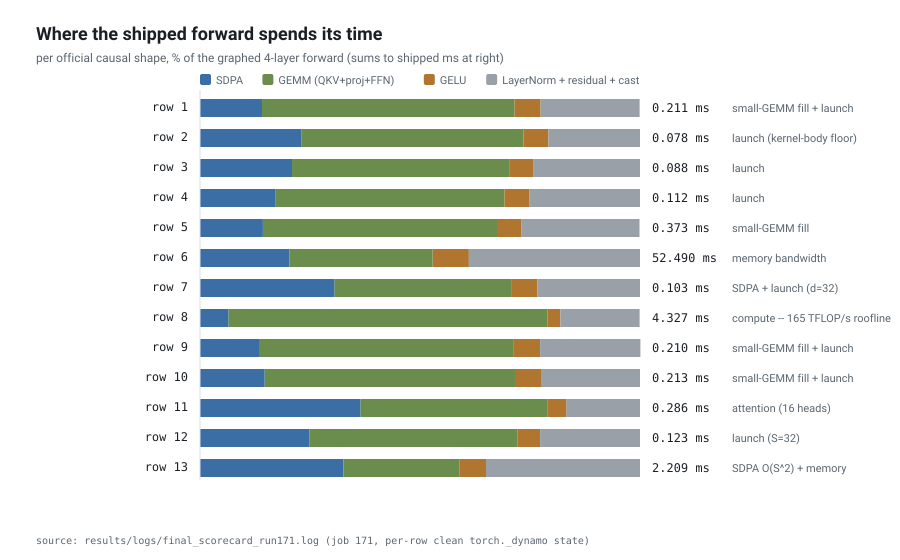
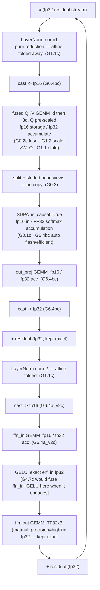
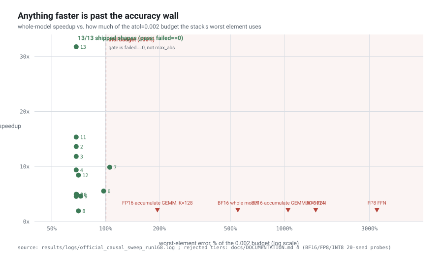
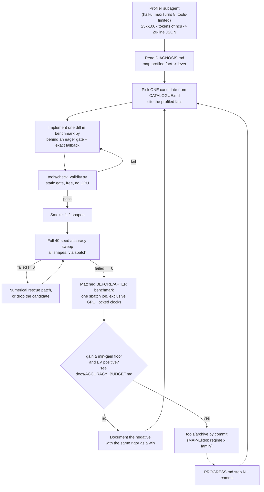
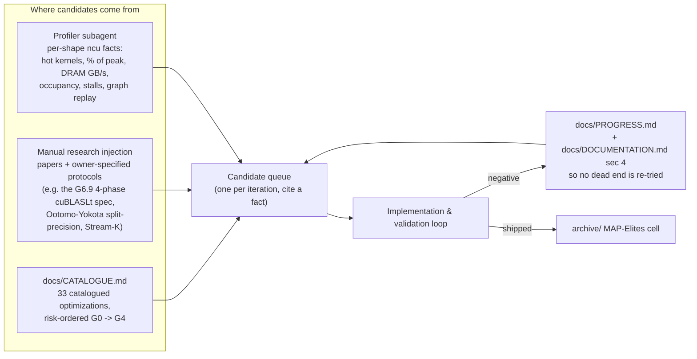

# GPU Kernel Acceleration of Transformer Algorithm on RTX 4090
> Submitted for Tiktok TechJam 2026.

> Kernel optimization of a Transformer Algorithm on consumer grade single-node RTX 4090 through an Agentic AI auto-research loop. Achieved performance improvements of **1.93x - 31.76x** over various test shapes, with **geometric-mean speedup ≈ 7.7×**


---
## Key Features

1. **We hit the hardware limit on the RTX 4090**. On the compute-bound shape, the optimized GEMMs runs at **94-96%** of the 165.2 TFLOP/s legal roofline. On the memory-bound shape, the elementwise path moves **22.7GB/forward against the structural limit of 23.6GB/forward**, which is the DRAM bandwidth roofline. The remaining gap can be attributed to non-removable runtime overheads.

2. **Built by Agentic Loop**. An agentic system was made to research, implement, verify and gate one diff at a time, with complex heuristics to balance performance and accuracy tradeoff. **Token budget mechanisms** were implemented through model selection and tiered implementation with low cost smoke checks. The agentic system was proficient in optimizing at the **PTX and SASS level with low level, complex toolchains like cuBLAS, CUDA, CUTLASS and CuAssembler.**

3. **Comprehensive Validation Loop**. Each run of validation runs on a pinned `Apptainer` container with `Slurm` used to reserve the **same fixed resource and persist GPU clock** and audit logging. Fair benchmarking achieved through multiple runs with random seeds, measured against GPU-side elapsed time. **Memory bias** is countered by alternating execution order between models to prevent L2 cache bias. **Anti-Gaming** through `check_validity.py` script to prevent models from bypassing actual computation through pointer manipulation, mandating each trial to test against a freshly computed reference output.

4. **Low Level Engineering**. Utilised AI-written:
> * Inline-PTX `mma.sync` GEMM
> * Warp-specialised named-barrier producer/consumer pipeline with `cp.async`
> * `CUTLASS` implementation comparison
> * `Fused Causal MegaKernel` from scratch
> * `cuBLASLt` algorithm search
> * SASS-level rewrite attempt via `CuAssmbler`


5. **Shape Based Strategy Arbiter**. Shapes are dynamically dispatched to different optimization strategies based on the per-shape benchmarking done at each validation round. This ensures that the best optimization techniques are used for each shape. The Arbiter conditions are **fine tuned accurately to the break-even point** (where we see performance gain).


## Results
Evaluated on the official test harness `torch_transformer_benchmark.py`, injected with the fully-causal test shapes with accuracy requirements `atol = 0.002`, `rtol = 0.02`. All test shapes passes the accuracy gate except Row 14.

>Row 14 (`S = 100000`) physically OOMs the GPU on the test harness due to GPU memory limitations. However, an alternate long sequence test was performed.

| # | B | d | H | S | baseline | **shipped** | speedup | max_abs |
|--:|--:|--:|--:|--:|--:|--:|--:|--:|
| 1 | 64 | 128 | 4 | 128 | 1.0465 ms | **0.2109 ms** | 4.96× | 0.00137 |
| 2 | 1 | 128 | 4 | 128 | 1.0618 ms | **0.0778 ms** | 13.64× | 0.00137 |
| 3 | 4 | 128 | 4 | 128 | 1.0426 ms | **0.0881 ms** | 11.84× | 0.00137 |
| 4 | 16 | 128 | 4 | 128 | 1.0466 ms | **0.1116 ms** | 9.38× | 0.00137 |
| 5 | 128 | 128 | 4 | 128 | 1.7039 ms | **0.3727 ms** | 4.57× | 0.00137 |
| 6 | 10000 | 128 | 4 | 128 | 290.55 ms | **52.486 ms** | 5.54× | 0.00195 |
| 7 | 64 | 32 | 4 | 128 | 1.0209 ms | **0.1034 ms** | 9.87× | 0.00211 |
| 8 | 64 | 1024 | 4 | 128 | 8.3611 ms | **4.3271 ms** | 1.93× | 0.00141 |
| 9 | 64 | 128 | 1 | 128 | 0.9688 ms | **0.2099 ms** | 4.62× | 0.00145 |
| 10 | 64 | 128 | 2 | 128 | 1.0473 ms | **0.2130 ms** | 4.92× | 0.00138 |
| 11 | 64 | 128 | 16 | 128 | 4.3858 ms | **0.2857 ms** | 15.35× | 0.00137 |
| 12 | 64 | 128 | 4 | 32 | 1.0376 ms | **0.1229 ms** | 8.44× | 0.00141 |
| 13 | 64 | 128 | 4 | 1024 | 70.153 ms | **2.2088 ms** | 31.76× | 0.00137 |

### Latency breakdown
> Different shapes are bounded by different limitations (compute / memory / accuracy). The graph below shows the breakdown of latency budget across all 13 test shapes.



---

## Contents

- [Context of the Problem](#context-of-the-problem)
- [Optimizations, Accepted and Rejected](#optimizations-accepted-and-rejected)
- [Agentic Auto-Research](#agentic-auto-research)
- [Performance and Accuracy Tradeoff](#performance---accuracy-tradeoff)
- [Setup and Reproducability](#reproducability)
- [Limitations and Future Works](#limitations-and-future-works)

---

## Context of the Problem

`BaselineTransformer` reference applies a pre-norm transformer with a manual `matmul > mask > softmax > matmul` attention. `UserOptimizedTransformer` produces the same forward outputs, within `atol = 0.002` **or** `rtol = 0.02` per element, as fast as possible.

### Our Context
**Development Environment**. Our target is a *single-node RTX 4090 consummer GPU* that runs on the *Ada Lovelace* architecture, with limited compute resource. This constrains us because:
- **No TMA**. Asynchronous global to shared movement must be hand-rolled with `cp.async` and a software pipeline.
- **No `wgmma`**. The load to MMA pipeline must be built from custom synchronous `mma.sync.m16n8k16` PTX.
- **No thread-block clusters or distributed shared memory**. Blocks may only cooperate through global memory.
- **GeForce Ada runs FP32-accumulate GEMMS at half rate**. cuBLAS is architectually capped at FP32 accumulation on this chip, which runs at half rate due to vendor nerfing (sad face).

> Thus, the problem shifts from cutting-edge optimization on server-grade architectures, to a **resource constrained hack (truly a hackathon!)**. This truly demonstrates the ability of Agentic AI, being able to optimize specific GPU hardware quirks through **auto research and validation** on actual hardware.

---

## Optimizations, Accepted and Rejected

### Accepted Optimizations
All applied optimizations are exact or precision-neutral, with the exception of two FP16-storage casts. These casts are strictly gated by an `atol = 0.002` budget and a fixed `allow_fp16_reduced_precision_reduction = False` (which forces FP32 GEMM reduction, entirely avoiding the FP16-accumulate tier). 

Because the tightest accuracy margin on the baseline stack sits at `max_abs = 0.00195` (97.5% of budget) and `0.00211` (which clears via the relative tolerance arm), the accept/reject rules for these implementations are exceptionally strict.

| ID | Optimization | Precision Class |
|---|---|---|
| **G0.1c** | SDPA replaces the manual `matmul→mask→softmax→matmul` loop (`is_causal=True`) | Exact | 
| **G0.2c** | Fused QKV: one `[d, 3d]` GEMM for three `[d, d]` | Exact | 
| **G0.3** | Strided head views into SDPA — no `.contiguous()` copy | Exact |
| **G0.5** | All-ones-mask fast path — skips no-op `masked_fill` passes | Exact |
| **G1.1c** | LayerNorm affine folded into consumer GEMM weights; LN becomes pure reduction | Exact (bit-identical) |
| **G1.2** | Attention scale `head_dim^-0.5 = 2^-3` folded into `W_Q` | Exact (power-of-two) |
| **G6.4bc** | FP16 storage for Q/K/V/out_proj around SDPA; unlocks automatic flash/mem-efficient dispatch | precision-reducing (FP32 accum) |
| **G6.4a_v2c**| FP16 storage for the `ffn_in` GEMM; casts back to FP32 immediately | Precision-reducing |
| **G2.4(b)**| `torch.compile(mode="reduce-overhead")` → CUDA-graph replay | Exact (no value change)|
| **G4.7c** | Fused `ffn_in` GEMM + exact-erf GELU epilogue on warp-specialised `mma.sync` kernel | Precision-neutral |
| **G4.3** | Warp-specialised `mma.sync` GEMM + CUTLASS-grade epilogue for attention projections | FP32-accumulate |
| **G6.6** | cuBLASLt explicit algorithm search + fused bias epilogue for FFN GEMMs | N/A |

> The graph below depicts the optimizations as part of the datapath

`x` enters in **FP32**. Per layer:



After the layer loop: `final_norm` (not folded — it has no consumer). The
FP32 residual stream is never downcast, both LayerNorms do only the mean/var
reduction, `ffn_out` deliberately stays at ≈FP32 (TF32x3).

### Hardware Limit Reached
The accuracy-legal roofline is `12·M·d²·L / 165.2e12` (GEMM FLOPs at the
FP16-storage/FP32-accumulate tier) + measured SDPA + a 0.855 µs/kernel body
floor. Per representative shape:


| Regime | Shapes | Binding wall | Shipped vs roofline |
|---|---|---|---|
| Latency / launch | 2–4, 12 | Kernel-body floor + Tensor-core pipeline fill on sub-roofline GEMMs | At the wall, without Hopper style Megakernel available (RTX 4090 runs Ada) |
| Compute | 8 | 165.2 TFLOP/s | GEMMs at **94–96%** isolated, 84% in-model (L2 contention across 34 kernels) |
| Memory bandwidth | 6 | DRAM GB/s | Elementwise at the roofline — **23.6 GB predicted vs 22.7 GB measured** |
| O(S²) attention + memory | 13 | Flash `O(S²)` + LayerNorm/residual traffic | SDPA at its achievable floor, LN traffic runs against L2 |

For more information, [`docs/PARETO_FRONTIER_ANALYSIS.md`](docs/PARETO_FRONTIER_ANALYSIS.md).


### Rejected Optimizations

Most optimizations failed either because they did not meet the accuracy requirements, or provided marginal gains proportional to the precision reduction caused.

| Attempt | Mechanism | Rejection |
|---|---|---|
| **Inline-PTX `mma.sync` FP16 GEMM** (G4.4) | Raw PTX targeting the FP16-accumulate tier (unavailable via cuBLAS on Ada). | **Performance (< 2%).** Only hit 55% of its tier's potential. The one shape it helps already spends ~90% of its budget on FP16 *storage*. |
| **Warp-specialised `mma.sync` pipeline** (G4.3 / G4.7) | Decoupled producer/consumer warp groups with zero-extra-shared-memory epilogue. | **Accuracy / HW limits.** FP16 arm failed causal bounds by 5× (0.0055). FP32 shipped, but only benefits massive shapes due to Ada's half-rate FP32. |
| **SASS-level rewrite** (G4.5) | Disassembling and reordering memory instructions for optimal scheduling. | **Toolchain wall.** CUDA 13.1 `nvdisasm` lossy-renders ELF sections, making reassembly impossible. |
| **CUTLASS bake-off** (G4.6) | Sweeping newer CUTLASS FP16-accumulate templates across configs. | **Accuracy / Perf limits.** Failed 80% perf gate, then permanently closed on accuracy (FP16 at K=512 costs ~7.5× error; 6 of 8 shapes fail). |
| **Fused causal megakernel** (G5.MEGA) | Fusing 4 layers into one block to keep residuals on-chip and avoid HBM traffic. | **Slower (×0.74).** Shared memory limits (96 KB) restricted it to 1 block/SM, killing occupancy and latency hiding. |
| **Offline cuBLASLt algo selection** (G6.9) | Static profiling and pre-selection of the best cuBLASLt algorithms per shape. | **Negative yield.** 25 of 27 signatures showed < 2% win; single isolated win degraded end-to-end performance by 12.5%. |
| **BF16 whole model** | Global precision reduction to BF16. | **Accuracy (~5.5× over budget).** Reached `0.0110` max error; 13.6% of elements fail on the first shape. |
| **BF16 FFN only** | Precision reduction isolated to FFN layers. | **Accuracy (~5.6× over budget).** Same order of error as whole-model, ruling out "attention was the risk". |
| **FP8 FFN** | Per-channel scaled FP8 quantization. | **Accuracy (~33× over budget).** 20 out of 20 seeds failed the accuracy check. |
| **INT8 FFN** | Fixed step-size quantization. | **Accuracy (~15× over budget).** Fixed step size cannot auto-range O(1) activations. |
| **Split-precision FP8** | Ootomo-style mixed FP8 precision. | **Arithmetic ceiling.** Passes accuracy at `k=4`, but yields no speed win. A 4-GEMM kernel's ideal 82.6 TFLOP/s matches TF32's existing peak. |
| **`torch.compile(max-autotune)`** | Automated graph compilation and tuning. | **Accuracy (~2.2–2.4× over budget).** Compilation incorrectly picks Triton software-TF32 over cuBLAS native. |
| **Degree-7 minimax GELU polynomial** | Polynomial approximation for GELU activation. | **Accuracy (~84× over budget).** The catalogued ~1e-6 estimate was wrong by 5 orders of magnitude (caught without a GPU). |

> The chart below depicts the accuracy vs performance tradeoff of our various optimizations.


---

## Agentic Auto Research

### Implementation & Validation loop


### Research Loop


---

## Performance - Accuracy Tradeoff
Optimizations are judged on the **performance-accuracy tradeoff**. Each optimization (whenever precision reducing), must provide substantial performance gains to warrant the precision reduction, as we have a fixed **accuracy budget**.

```
EV(ship X) ≈ P(gain real)·gain − P(X Pushes an unseen shape over budget)·(Entire score → 0)
```

A strict ceiling of `max_abs ≤ 0.00180` (90% of budget) and reserve target
`≤ 0.00170` is applied. Minimum-gain floor **~0.3–0.5% whole-model** for anything with precission reduction. **Exact transforms (the G1 folds, CUDA graphs, the G4.7 exact-erf epilogue) cost
zero budget**, and is accepted whenever it provides a performance gain.

---

## Reproducability

### Prerequisites

**Development Environment**
* Ubuntu Server LTS 26.04 (Linux 7.0 Kernel) with Slurm and Apptainer
* NVIDIA GeForce RTX 4090 (`sm_89 Ada Lovelace`), 24564MiB VRAM
* 32GiB DDR5 Ram
* ~15GB Disk Space required for full Image

### Run

> The evaluation runs on the official test harness provided by TikTok TechJam

```bash
# 1. Build the reproducible image  (-> /scratch/kernel.sif; ~10 min)
bash infra/apptainer/build.sh

# 2. Run the official evaluation  (rows 1-13; row 14 OOMs the baseline)
./run_eval.sh                       # or: make eval
#    per-row logs + a summary table land in results/logs/
#    override the entry point:      ENTRY=benchmark.py ./run_eval.sh
#    attempt row 14 anyway:         RUN_ROW14=1 ./run_eval.sh

# 3. Regenerate the README figures
make figures                        # tools/make_figures.py -> assets/*.svg

# 4. Integrity checks
make check                          # verify_baseline + sync_entrypoint --check + check_validity
bash infra/verify_submission.sh dist/techjam2_*.tar.gz    # after `make package`

# 5. Regenerate the standalone judge drop-in from benchmark.py
make entrypoint                     # -> torch_transformer_benchmark.py
```

### Tools, Libraries, Datasets
- **Development Tools:** Claude Code · Slurm · Apptainer · NVIDIA Nsight Compute / Systems 13.1 ·
  `nvcc` 13.1 · git · tmux.
- **APIs:** None.
- **Libraries / Frameworks:** PyTorch 2.13.0 (cu130) · Triton 3.7.1 · CUDA /
  inline PTX · CUTLASS 4.7.1 (header-only) · cuBLAS / cuBLASLt · pybind11 ·
  NumPy · `torch.compile` (Inductor).
- **Datasets / Assets:** None. Inputs are synthetic random tensors from `generate_random_case`.

### Repository
```
├── benchmark.py                     Entry point + source of truth
├── torch_transformer_benchmark.py   Generated judge drop-in (tools/sync_entrypoint.py)
├── run_eval.sh · Makefile           Standardized eval
├── csrc/                            Hand-written CUDA / C++ / inline-PTX (csrc/README.md — 3 files build at eval)
├── tools/                           verify_baseline · sync_entrypoint · check_validity · archive · make_figures · parse_ncu · slurm
├── experiments/                     64 g0-g6 investigation drivers (experiments/README.md)
├── infra/
│   ├── apptainer/                   kernel.def + build.sh — Reproducible image
│   ├── slurm/                       *.sbatch — Batch scripts
│   └── run_container.sh · package.sh · verify_submission.sh
├── results/
│   ├── logs/                        120+ Slurm job receipts — every number in the docs traces here
│   └── artifacts/                   NCU JSON summaries, ground_truth.csv
├── archive/                         MAP-Elites elite-config store (archive/README.md)
├── assets/                          README figures (Generated via make figures)
├── docs/                            ARCHITECTURE · PROGRESS (52-step log) · DOCUMENTATION · FINAL_SCORECARD
│                                    · PARETO_FRONTIER_ANALYSIS · ACCURACY_BUDGET · SETUP · CATALOGUE · AGENTS · ...
└── CLAUDE.md                        The agent's operating manual
```

---

## Limitations and Future Works

- **Forward pass only.** No backward / training path.
- **Row 14 (`S = 100000`) is unscorable here**. A single `[32, 100000, 1024]`
  FP32 activation is 12.2 GiB, and the FP32 baseline's manual attention needs
  an `[S, S]`-per-head score tensor no 24 GB card can hold. It needs multi-GPU
  sharding or a chunked baseline.
- **Ada-specific.** The precision choices, tile sizes, and the "no megakernel"
  conclusion are calibrated to `sm_89`; a Hopper port would reopen TMA +
  `wgmma` + a persistent fused kernel and change the answer.
- **The last ~10–15% to roofline is left on the table** — Recovering it means CUTLASS-grade / persistent-kernel engineering that Ada cannot achieve on standard toolchains.
- **The accept/reject heuristic is tuned to this exact budget** (`0.002 /
  0.02`), a tighter budget would retroactively un-ship the two FP16 casts.
  
---

## License · Acknowledgments

[MIT](LICENSE) © 2026 Yeo Shu Yi.

Built with [Claude Code](https://claude.com/claude-code). Frozen baseline and
evaluation harness per the TikTok TechJam problem statement (Problem 3 —
*Implement a GPU Kernel for a Transformer Layer*). Devpost write-up:
[`docs/DEVPOST.md`](docs/DEVPOST.md). Full engineering log:
[`docs/PROGRESS.md`](docs/PROGRESS.md) (52 steps) ·
[`docs/DOCUMENTATION.md`](docs/DOCUMENTATION.md) (every optimization,
shipped/closed, with measured numbers).
