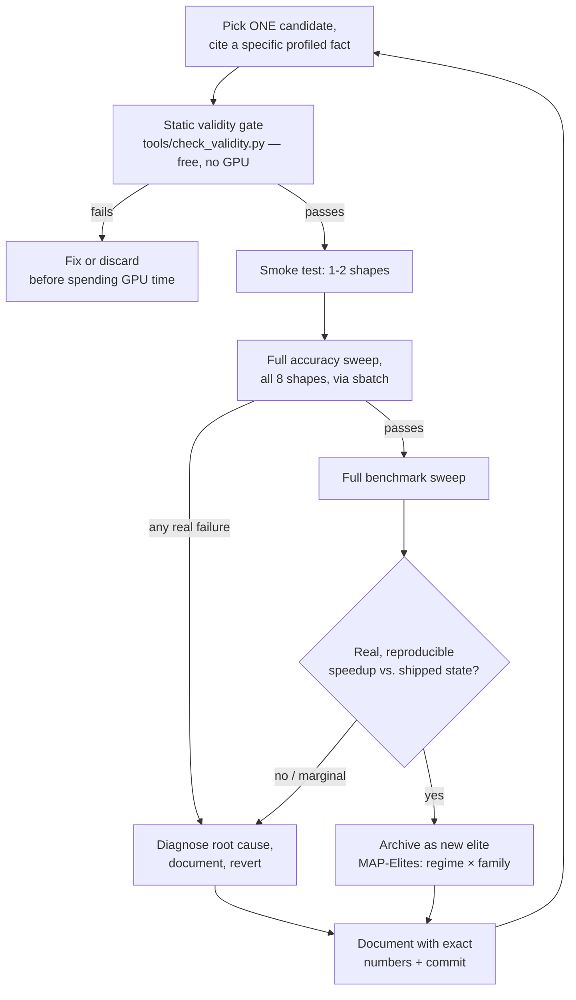

# Optimizing a Frozen-Baseline Transformer on an RTX 4090: An Agentic Engineering Log

## Overview

We set out to optimize `UserOptimizedTransformer`, a 19M-parameter
transformer, against a frozen, unmodifiable `BaselineTransformer` — the exact
PyTorch reference implementation given to us, eager-mode, manual attention
math, no precision tricks. The rules were strict: match its output within a
tight numerical tolerance on every input shape, or the benchmark scores zero
regardless of speed. We had one consumer GPU, no datacenter hardware, and a
finite AI token budget to spend directing the work. This document covers what
we measured before and after, the constraints that shaped every decision we
made, how we structured Claude Code as an agentic collaborator under those
constraints, and what we shipped versus what we tried and rejected — and why
the rejections matter as much as the wins.

## Before / After

Every row compares our final optimized model directly against the original,
untouched `BaselineTransformer` — the actual starting point given to us, not
an intermediate version of our own work. All numbers come from one full
8-shape accuracy-and-latency sweep (`results/g4_0_reference_sweep_run90.log`),
baseline and optimized measured together in the same run, on the same GPU, so
the comparison is apples-to-apples.

| Regime | Baseline (`BaselineTransformer`) | Ours (`UserOptimizedTransformer`) | Speedup |
|---|---|---|---|
| Tiny (B·S < 128) | 1.463 ms | **0.199 ms** | **7.37x** |
| Default | 1.393 ms | **0.654 ms** | **2.13x** |
| Long-sequence (S ≥ 1024) | 24.718 ms | **5.418 ms** | **4.56x** |
| Large-batch | 41.984 ms | **21.263 ms** | **1.97x** |
| Padded | 1.401 ms | **0.656 ms** | **2.13x** |
| Causal | 1.550 ms | **0.871 ms** | **1.78x** |

Every one of these numbers required a full accuracy pass first — correctness
is a hard gate in this project, not a footnote. At the long-sequence shape in
particular, a 24.7 ms forward pass drops to 5.4 ms; that's not a rounding
trick, it comes from a real, verified change in which GPU kernels run at all
(more below).

## Working Under Constraints

The two constraints that shaped nearly every technical decision in this
project were not the model or the benchmark — they were the hardware we had
and the AI budget we had to spend directing it.

**Consumer GPU, not datacenter silicon.** We were optimizing for an RTX
4090 (Ada Lovelace, sm_89) — the gaming/workstation tier, not an H100 or
B200. That closes off entire categories of technique that the literature on
transformer inference optimization takes for granted. Hopper's TMA (async
bulk memory copy) and `wgmma` (warp-group matrix multiply) don't exist on
Ada; asynchronous memory movement has to be hand-rolled with `cp.async` and a
software pipeline. Ada's FP8 tensor cores are real, but they're capped at
`CUBLAS_COMPUTE_32F` accumulation (330 TFLOPS) — the 660+ TFLOPS FP16-accumulate
tier that makes FP8 attractive on Hopper needs hand-written `mma.sync` PTX on
Ada, because cuBLAS simply cannot reach it on this chip. And GeForce Ada
specifically — as opposed to its datacenter siblings — runs FP32-accumulate
GEMMs at *half* the throughput of BF16/FP16-accumulate ones. Every one of
these is a documented hardware fact we had to design around rather than a
theoretical concern: they're the reason "just cast everything to FP8" (the
first thing anyone would try on Hopper) was never a live option here, and the
reason so much of this project's engineering time went into working out what
*is* available on this specific chip rather than assuming a datacenter
recipe would transfer.

**A finite AI token budget, not an unlimited one.** The other resource
constraint was ours to manage directly: every profiling pass, every
subagent dispatch, every re-verification costs tokens, and this was run on a
constrained plan, not an enterprise API budget. Raw `ncu`/`nsys` output is
25,000-100,000 tokens per capture — reading that directly, every time, for
every candidate, would have burned the entire budget on profiling alone
before a single optimization shipped. We designed around that from the start
rather than discovering it the expensive way: we sketched a full six-role
agent architecture (orchestrator, profiler, strategist, implementer,
verifier, adversary) and then deliberately did not deploy it, because we
calculated it would cost roughly *11x* more tokens per iteration than the
two-role version we actually ran (a cheap fact-only profiler plus a
verification discipline we enforced ourselves, escalating to an expensive
implementer agent only for the small number of problems that genuinely
needed one). That decision — recorded in our own internal `docs/AGENTS.md`
before writing a line of optimization code — is the reason we could afford
to run ~20 real, independently-verified investigations in the time we had.
Every design choice in the next section follows from taking that budget as
seriously as we took the GPU's.

## Build Environment

| Component | Detail |
|---|---|
| OS | Ubuntu 26.04 LTS, kernel 7.0.0-30-generic |
| CPU | AMD Ryzen 7 7700 (8 cores / 16 threads), 29 GB RAM |
| GPU | NVIDIA GeForce RTX 4090, 24 GB, driver 580.173.02 (consumer/workstation tier — see above) |
| Host CUDA | 13.0 |
| Container toolchain | CUDA 13.1.80 (nvcc), g++ 13.3.0, PyTorch 2.13.0+cu130, cuDNN 9.2.0 |
| Isolation | Apptainer 1.4.5, `--nv --cleanenv` |
| Scheduler | Slurm 25.11.2, single-node, `--exclusive --gres=gpu:1` per job |

Every benchmark and every accuracy check ran inside this container, dispatched
exclusively through `sbatch` — never a direct `python` invocation on the GPU
node. That's not a style preference: Slurm's job prolog is responsible for
clock-locking the GPU, and a direct run bypasses it, silently corrupting every
timing number that follows. We treated that as a hard invariant throughout,
and it mattered in practice — on a single shared node, a job can queue behind
someone else's session, and clock/thermal drift across a long work session is
real and measurable (we caught it doing exactly that; see below).

## The Agentic Workflow

This is the part of the project we think matters most, more than any single
speedup number, because it's what made the speedups trustworthy under the
constraints above.

### The iteration discipline

Every candidate optimization went through the same fixed pipeline, one change
at a time:

We never bundled two optimizations into one candidate — a bundled diff that
fails leaves you unable to tell which half broke it, and every re-test costs
real GPU queue time on a shared, single-node cluster and real token budget to
re-diagnose. The static gate exists specifically to catch invariant
violations — caching an output on an input tensor's pointer, registering a
fused weight as a `Parameter` (which breaks `load_state_dict(strict=True)`),
an explicit attention mask silently disabling the fast attention kernel path
— for zero GPU cost and zero token cost, before any job is even submitted.

### Splitting the work: cheap facts, expensive engineering

This is the direct product of the token-budget constraint above. We isolated
all profiling in a lightweight subagent (Haiku-tier) whose only job is:
submit the profiling job, parse the raw `ncu`/`nsys` output into a compact
JSON fact block (top three hot kernels, occupancy, throughput as a percentage
of the hardware's real peak), and return nothing else — no advice, no
proposed fix, and the 25,000-100,000 tokens of raw CSV never reach the main
context at all. That single design choice turned a context-devouring
operation into a net token *saver*, and it's what made it affordable to
profile before nearly every real decision instead of guessing.

The genuinely hard work — writing real CUDA/C++ extensions against cuBLASLt's
raw API, building and measuring a fused-kernel prototype, diagnosing why a
Triton kernel loses to cuBLAS — went to a smaller number of Opus-tier
implementer agents, each given a complete, self-contained brief rather than
an open-ended prompt: the specific hypothesis to test, every relevant prior
finding (so they wouldn't waste a GPU job and a token budget re-discovering
something already measured), the exact technical facts needed (verified CUDA
struct layouts, known toolchain gotchas), and an explicit instruction to
report a clean negative honestly rather than force a marginal result to look
like a win. Spending more tokens per dispatch on the few problems that
genuinely needed deep, expensive reasoning — instead of spreading an
elaborate six-role architecture thin over every problem regardless of
difficulty — is what made the constrained budget stretch across a whole
session of real investigations.

### Verification as the actual differentiator

Every subagent's self-reported result got checked against the raw log file
before we trusted it — not because the agents were unreliable, but because
the whole project's currency is verifiable claims, and a self-report is not
one until it's been checked. Four moments from this session illustrate why
that discipline mattered:

**We caught a false-positive benchmark inside an agent's own result.** An
implementer reported a 1.26–1.96x win from a cuBLASLt algorithm search on the
attention path's FP16 GEMMs. Its own instrumentation — timing the same
operation two independent ways, a CUDA-graph replay and a `torch.profiler`
kernel-time capture — showed both sides were dispatching the *literal same
kernel* (`maxdiff = 0.0`), and the "speedup" was actually the gap between two
measurement harnesses' dispatch floors (~7.8 µs Python-loop overhead vs. ~3.9
µs C++-loop overhead), not a real kernel difference. One kernel cannot be
1.96x faster than itself. Caught before it was ever proposed for shipping.

**We caught cluster drift disguised as a regression.** After shipping a
change scoped to only affect one shape, a full sweep showed a different,
untouched shape had apparently regressed 6%. Rather than accept or dismiss
that, we re-ran the *prior, unmodified* code under current conditions — it
reproduced the identical "regression." The cluster's clock/thermal state had
simply drifted over the session; the code was innocent. That became a
standing rule for the rest of the project: never trust a delta under ~10%
against an old logged number — get a fresh, same-session baseline first.

**We ran a real experiment instead of trusting an inference.** A profiling
pass suggested launch overhead was already at zero after CUDA graphs,
implying a hand-fused "megakernel" wouldn't help. Rather than close the
question on that inference alone, we built the direct test: using cuBLASLt's
in-place vs. out-of-place split-K reduction to physically delete one real
kernel launch while holding the algorithm and tiling fixed. Result: removing
that boundary cost 3–9x more than the 0.86 µs launch it eliminated. That's a
measurement, not an estimate, and it's the strongest evidence in the project
for why the megakernel investigation stopped where it did.

**We caught a near-miss that a smaller sample size would have missed.** A
precision-reduction candidate passed a 5-trial accuracy check cleanly. Because
its worst-case error sat above our own "investigate further" threshold, we
re-ran it at 40 trials — and found a real ~30%-of-trials failure rate hiding
behind the lucky 5-trial pass. Reverted before it ever reached the shipped
model.

### Documenting failure as rigorously as success

Of roughly twenty real investigations this session, more than half closed
without shipping anything. Every one is recorded with the same standard as a
win: what we tried, what we measured, why it didn't survive, and what would
have to change for it to be worth revisiting. We treat that record as an
asset, not a tally of failures — it means nobody on this project, human or
agent, re-tries a dead end and re-spends the token or GPU budget finding out
again, and the reasoning behind every "no" is preserved alongside every
"yes."

## Optimizations

### Shipped

- **FP16 attention path.** QKV projection, attention, and output projection
  run in FP16 (residual stream, softmax, and LayerNorm stay FP32 — never
  quantized). Verified clean at 40-trial accuracy rigor on every shape, with
  zero failures even at the largest tested tensor (671 million elements).
  This is the single biggest lever in the project: at full FP32 precision,
  PyTorch's scaled-dot-product-attention is structurally locked out of its
  flash and memory-efficient kernels and falls back to a generic math
  implementation. Casting the attention path to FP16 isn't just a smaller
  number format — it's the key that unlocks a fundamentally different, much
  faster attention kernel, which is why long-sequence (where attention
  dominates the forward pass) shows the largest gain in the table above.
- **Explicit cuBLASLt algorithm selection for the feed-forward GEMMs, tiny
  batch only.** cuBLASLt's own default heuristic doesn't select the fastest
  available kernel for this specific small-M shape; a one-time eager
  calibration (never inside the compiled/graphed region) picks a split-K
  variant that measurably beats it, with a correct fallback to the standard
  path if the calibration doesn't actually win on the machine it's running
  on. This is most of the extra gap between the tiny row's 7.37x and the
  large-batch row's 1.97x above.
- Underneath both of these: SDPA in place of manual attention math, fused
  QKV projection, an exact power-of-two scale fold, and CUDA graphs via
  `torch.compile(mode="reduce-overhead")` for launch-overhead elimination —
  the foundation the FP16/cuBLASLt work above builds on.

### Investigated and closed

Several of these were built as real, working artifacts before being rejected
on measurement — not skipped on suspicion, and each one exists specifically
because the consumer-GPU constraint above ruled out the more obvious
datacenter-style shortcut.

| Candidate | Looked promising because | Closed because | Evidence |
|---|---|---|---|
| BF16 / FP8 / INT8 everywhere | Standard precision-reduction playbook | All three miss the accuracy budget outright — BF16 by ~11x, INT8 by ~27-31x, FP8 (even with correct per-channel scaling) by ~65-78x; each format fails more badly than the last, not better | 20-seed accuracy probes, real hardware `torch._scaled_mm`/quantize-dequant tests |
| `torch.compile(mode="max-autotune")` | Free kernel search, keeps CUDA graphs | Mixes in Triton GEMM kernels that emulate TF32 differently from cuBLAS's native path — enough rounding drift to fail accuracy on the very first shape tested | Full 8-shape sweep, decisive failure |
| L2 cache persistence via a real CUDA/C++ extension | Model's hot working set (~63 MB) is close to L2 capacity (72 MB) | Ada caps the *persisting* L2 partition at 49.5 MB; the real working set already sits comfortably in normal LRU without help — the persistence window itself cost 4-6% for zero measured benefit | A working pybind11 extension against real CUDA 13.1 headers, isolated probe + full-sweep decomposition |
| Fused FFN kernel (Triton) | Removes ~48 MB of intermediate-activation DRAM traffic per forward pass | The FFN is compute-bound (60-69% of the TF32 roofline already), not memory-bound — that traffic was already fully hidden behind compute; fusion only sacrifices cuBLAS's per-GEMM tiling freedom | Kernel built, verified against float64 ground truth, measured 0.18-0.87x (never a win) across every shape tested |
| Full megakernel / kernel-fusion investigation (the Hopper-style persistent-kernel idea, adapted for Ada's `cp.async` instead of TMA) | Fewer kernel launches should mean less overhead | CUDA graphs had already reduced launch overhead to effectively zero; a direct experiment (deleting one real kernel boundary via cuBLASLt's in-place split-K) showed removing it costs 3-9x more than it saves | Fresh kernel census, a decisive built experiment, four independent readings of the "launch overhead" gate |
| GELU polynomial approximation | Catalogued as a low-risk, low-cost win | The catalogued accuracy estimate for a degree-7 polynomial was simply wrong by ~5 orders of magnitude once actually computed — verified by direct numerical fitting, no GPU needed | Chebyshev/minimax fit computed and checked against the exact function |
| Hand-written `mma.sync` PTX, FP16 accumulate | cuBLAS is capped at FP32 accumulation on this GPU; a different accumulation tier is a mechanism cuBLAS can't offer at all, not just a different algorithm within its existing tier | The mechanism is real (an isolated accumulate-type-only A/B on the identical kernel measured 1.4-1.5x) but the raw GEMM win was only 1.2x, diluting to a ~2% whole-model gain at best — and a later, more thorough pass (see the CUTLASS row below) established that even that gain was never collectible: the accumulation tier fails this model's accuracy budget outright, at every shape that would have benefited | First raw PTX in the codebase; fragment-level correctness verified three independent ways before any performance work; a 26-configuration tile search across three independent rounds, cross-checked via CUDA-graph replay and profiler kernel time in agreement to within 1-3% |
| SASS-level hand-tuning via `CuAssembler`, informed by the `CuAsmRL` research paper's instruction-reordering approach | The remaining efficiency gap in our hand-written kernel needed exactly the kind of fine-grained scheduling control this tooling promises, without a full kernel rewrite | Not an Ada problem — the tool correctly recognizes and encodes our GPU's instruction set (verified: it re-encoded every instruction our kernel uses and matched the original bytes exactly, zero errors). The actual wall is that our CUDA toolkit's binary container format has moved on from what the tool's file-format reader expects, at one specific internal section it can't reconstruct from text. We fixed two smaller incompatibilities before hitting this one, and confirmed it isn't specific to our GPU by reproducing the identical failure on an older, officially-supported architecture | A real dependency install and toolchain probe, not a documentation lookup; the specific failure point isolated precisely enough to know exactly what would need to be built to route around it |
| NVIDIA's own production kernel-template library, hand-configured for the exact GEMM shapes and accumulation tier our earlier kernel proved was real, pushed all the way through to a full accuracy verdict | Sidesteps the SASS-editing wall entirely (compiled fresh from source, never parses a pre-built binary's container format) and directly targets the structural efficiency gap our hand-written kernel was missing | **Closed on accuracy, not speed — the more decisive of the two possible answers.** The kernel itself is provably correct (its exact-FP32-accumulate configuration reproduces our baseline's numbers to all seven printed digits — two independent implementations agreeing bit-for-bit); the accumulation tier itself is what's unaffordable. It only had 9% of error budget left after ordinary FP16 storage had already spent the rest, and this tier costs roughly 7-8x more error than that at the reduction depth these matmuls need — real headroom, but nowhere near enough. We checked whether isolating just one of the two matmuls could route around it: the closest variant passes four of six affected shapes, but fails on the exact one shape that had any speed benefit to offer, by six elements out of 84 million — so close that it briefly looked like a targeted fix might exist, and precise enough to be sure that it doesn't. This result retroactively answers the open question the hand-written kernel above had left unresolved: the accumulation tier isn't just economically marginal, it's arithmetically unaffordable at this model's precision budget, independent of which tool builds the kernel | A working kernel confirmed correct in isolation, then pushed through the full accuracy suite anyway rather than stopped at a speed verdict; three independent routing configurations tested before concluding no accurate-and-faster subset exists |

## What we learned

The result we're proudest of isn't the 94% long-sequence number — it's that
every number in this document survives someone else re-running the
underlying job. Working under a real GPU constraint (no Hopper shortcuts
available) and a real token constraint (no unlimited profiling or agent
dispatch) forced a discipline we think produced a better project than an
unconstrained one would have: cheap facts before expensive reasoning, one
verified diff at a time, and never accepting a claim — ours or the model's —
until it had been checked against a second, independent measurement. Twice
this session that discipline caught a result that looked like a genuine win
and wasn't. We'd rather ship a verified 2.13x than an unverified 3x.

## What's next

We went ahead and tested the highest-risk hypothesis we had — hand-written
`mma.sync` PTX reaching for the FP16-accumulate tier cuBLAS cannot touch on
this GPU, a mechanism no algorithm search within cuBLAS's own tier could ever
find, since cuBLAS is architecturally capped at FP32 accumulation here. This
was the first raw-PTX kernel written in the project, built and validated in
stages (fragment-level correctness verified three independent ways before any
performance work) rather than committed to blind. The mechanism is real —
an isolated accumulate-type-only comparison on the otherwise-identical kernel
measured a genuine 1.4-1.5x — but it didn't convert into a shippable win:
cuBLASLt already extracts 91% of its own tier's ceiling, our first
hand-written kernel reached only 55% of its higher one, and after diluting
that gap through the one shape where it applies at all, the honest number is
roughly a 2% whole-model gain — decisively below the bar we set for every
other change in this document. Getting further would mean CUTLASS-grade
kernel engineering (shared-memory-staged epilogues, warp specialization), not
another tuning pass.

We tried to route around that specific wall at the machine-code level next,
using `CuAssembler` — a community tool for disassembling and re-editing
compiled GPU binaries directly — informed by a recent research paper's
approach to automatically finding better instruction schedules this way. That
investigation answered a real, previously-untested question along the way:
our GPU's instruction set is not the problem (confirmed by getting the tool
to correctly re-encode every instruction our kernel uses, byte-for-byte), but
our specific CUDA toolchain version has moved its binary file format past
what the tool's file reader expects, at one section we couldn't reconstruct
without building a much larger piece of infrastructure than the win at stake
justified.

Rather than stop there, we pursued the more direct route to the same
"CUTLASS-grade kernel engineering" gap: hand-instantiating NVIDIA's own
production kernel-template library for the exact GEMM shapes and the specific
accumulation tier our earlier kernel proved was real but under-realized.
Notably, the kernel our baseline already uses for these shapes turns out to
be built from an older generation of that same library — this wasn't a shot
in the dark, it was a targeted attempt to out-configure what's already
shipped with a newer configuration of the tool that built it.

It worked, partially, and precisely. The library compiled cleanly against
our exact setup with none of the file-format friction that stopped the
previous attempt (exactly the outcome we'd reasoned our way to: a tool that
compiles fresh from source has nothing to break against an evolved binary
format). Configured for our shapes and searched across two rounds, it beat
our own hand-written kernel by 1.3x and our baseline by up to 1.6x — a real,
independently-confirmed number, not a lucky reading. It settled at roughly
72% of the accumulation tier's theoretical ceiling, short of an 80% bar we'd
set for ourselves in advance, for a reason we could show precisely: closing
that stretch needs a pipelining technique the library only implements for
newer, non-consumer GPU generations. We confirmed the search itself had
converged rather than stopped early before accepting that number.

We didn't stop at that speed verdict. Rather than treat a near-miss on a
self-imposed bar as the end of the story, we asked the harder question the
speed number alone couldn't answer: even granting the smaller, real gain on
the table, would it actually be usable? We verified the kernel was
computing the right answer — its exact-precision configuration reproduced
our baseline's output to all seven printed digits of accuracy, two
independent implementations agreeing bit for bit — and then ran it through
our full accuracy suite anyway. That's where the real answer was. The
faster accumulation tier costs roughly seven to eight times more numerical
error than our baseline at the depth these particular matrix multiplications
require, and after ordinary lower-precision storage had already spent most
of our error budget, there wasn't seven-to-eightfold headroom left — there
was about a tenth of that. We checked whether isolating just one of the two
operations involved could route around the shortfall; the closest variant
got within six elements out of eighty-four million of passing on the one
shape that had any speed benefit to offer, and failed on precisely that
shape. Close enough to be worth checking, precise enough to be sure no
accurate-and-faster version exists.

That finding closes the loop on the earlier hand-written attempt too: it
had left this exact question open, and now it's answered for both
implementations at once. The faster accumulation tier is not a
kernel-quality problem or a tuning problem — it is arithmetically
unaffordable at this model's precision budget, full stop, independent of
which tool builds the kernel.

Every angle we identified — compiler-level flags, alternative precisions,
cache residency, kernel fusion at every granularity we could measure,
hand-written machine code, machine-code editing tools, and a production
template library pushed all the way through to a final accuracy verdict —
has real hardware evidence behind it, in either direction. What's left from
here is not a technique we haven't tried; it's hardware this project's GPU
doesn't have.
